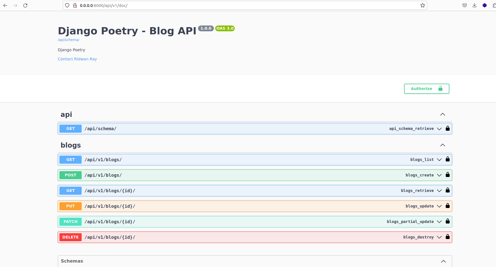

# Dockerised Django project with Poetry
Using Poetry and Docker in a django project. <br>
This article has complete guide:  [check here](https://ridwanray.medium.com/setting-up-a-django-project-with-docker-and-poetry-f391d6cde2cf)

# Setup & running locally

Create a .env file by copying the .env.sample provided and run:
```
docker compose build && docker compose up
```
to start the container. As an alternative, run:
```
docker-compose -f docker-compose.dev.yml up --build
```
to build and run the container using the dev yaml file.
Make sure to externalize the db instance to be used. It can be in another container.

## Run tests
Run descriptive tests in the container using:
```
docker exec -it <container_name> poetry run pytest -rP -vv
```

Access the docs on:

```
http://localhost:8000/api/v1/doc
```

